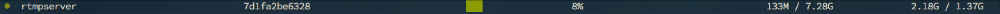
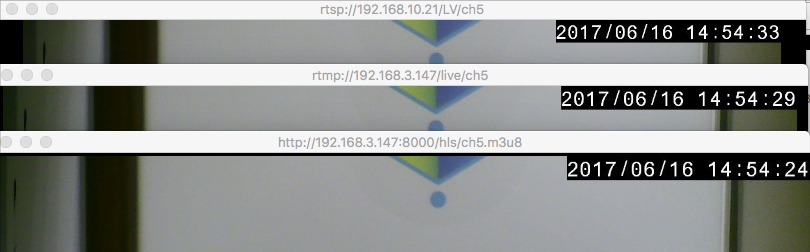

# 使用 HTML5 瀏覽 RTSP 串流 
> 利用 NGINX, nginx-rtmp-module, FFmpeg

## Demo

### Server side (Ubuntu with docker)

#### 1. Clone the src code

```shell
$ git clone https://github.com/moiamond/rtsp2h5-demo
$ cd rtsp2h5-demo/nginx-rtmp
```

#### 2. Run NGINX server

```shell

$ docker run -d \
    --name rtmpserver \
    --restart always \
    -p 8000:80 \
    -p 1935:1935 \
    -v $(pwd)/nginx.conf:/etc/nginx/nginx.conf:ro \
    -v $(pwd)/app/:/opt/nginx/html/app/ \
    moiamond/nginx-rtmp
```

以下為 Server 可以存取的 link

RTMP Endpoint
> rtmp://{SERVER IP}:1935/live/{YOUR STREAM}

RTMP 狀態
> http://{SERVER IP}:9900/stat

HLS 路徑
> http://{SERVER IP}:9900/hls/{YOUR STREAM}.m3u8

測試 6 channel 的網頁
> http://{SERVER IP}:9900/app/viewer.html

#### 3. Streaming RTSP to server

利用 FFmpeg 將 RTSP 串流打到剛剛啟動的 RTMP Server

```shell
$ ffmpeg -rtsp_transport tcp -i rtsp://192.168.10.21/LV/ch7 -c:v copy -an  -f flv rtmp://192.168.3.147/live/ch7
```

可以到 `http://{SERVER IP}:9900/stat` 頁面，觀察目前 Server 接收到 rtmp 串流的資訊

#### 4. Check HLS Result

這時 `nginx-rtmp-module` 會開始將接收到的 RTMP 串流，產生 HLS 相關檔案。以第三步的例子來看，HLS 網址為 `http://{SERVER IP}:9900/hls/ch7.m3u8`。

此 Demo 會在第三步打6個 RTSP 串流到 Server，分別為

1. `rtsp://192.168.10.21/LV/ch1`
1. `rtsp://192.168.10.21/LV/ch2`
1. `rtsp://192.168.10.21/LV/ch3`
1. `rtsp://192.168.10.21/LV/ch4`
1. `rtsp://192.168.10.21/LV/ch5`
1. `rtsp://192.168.10.21/LV/ch7`

此時可以用瀏覽器開啟 `http://{SERVER IP}:9900/app/viewer.html` 即可看到以下畫面


此時 Server 的使用率如下



1. CPU: 8%
1. Mem: 133 M

網路延遲

```
      4s delay         5s delay
RTSP ----------> RTMP ----------> HLS
```

